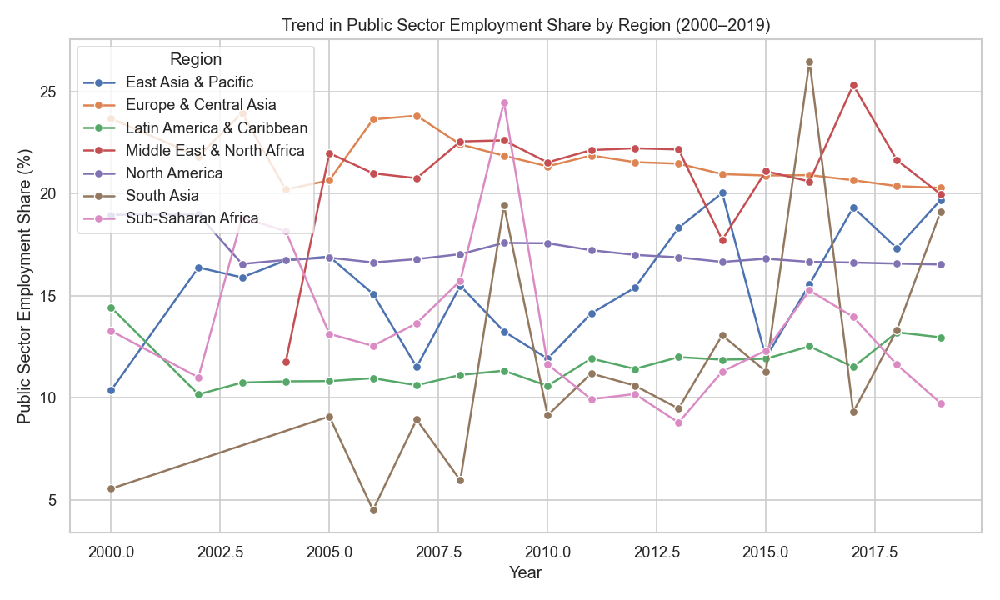
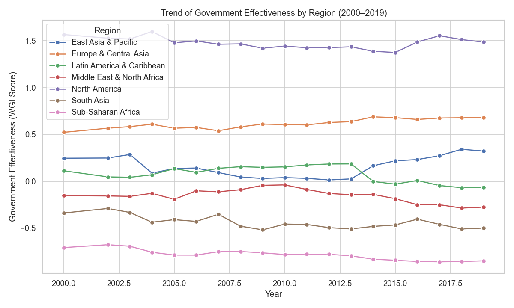
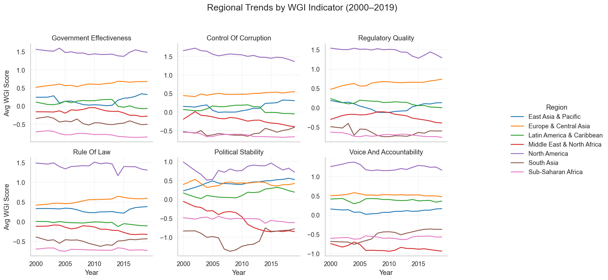
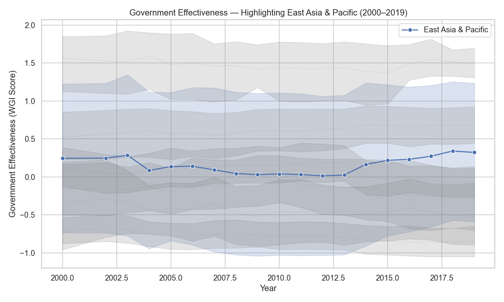
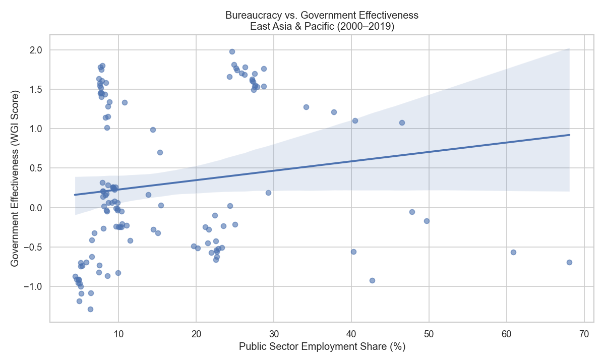
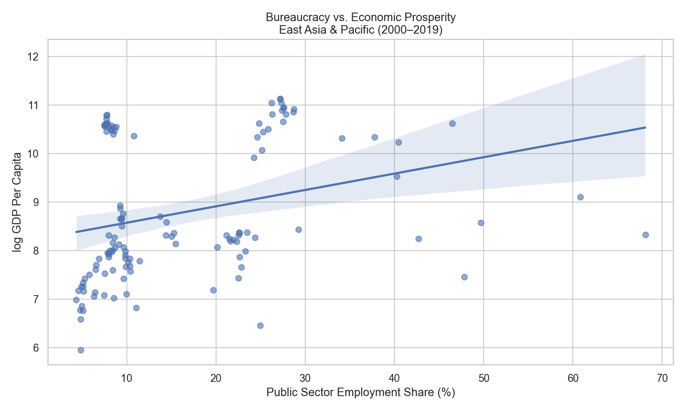
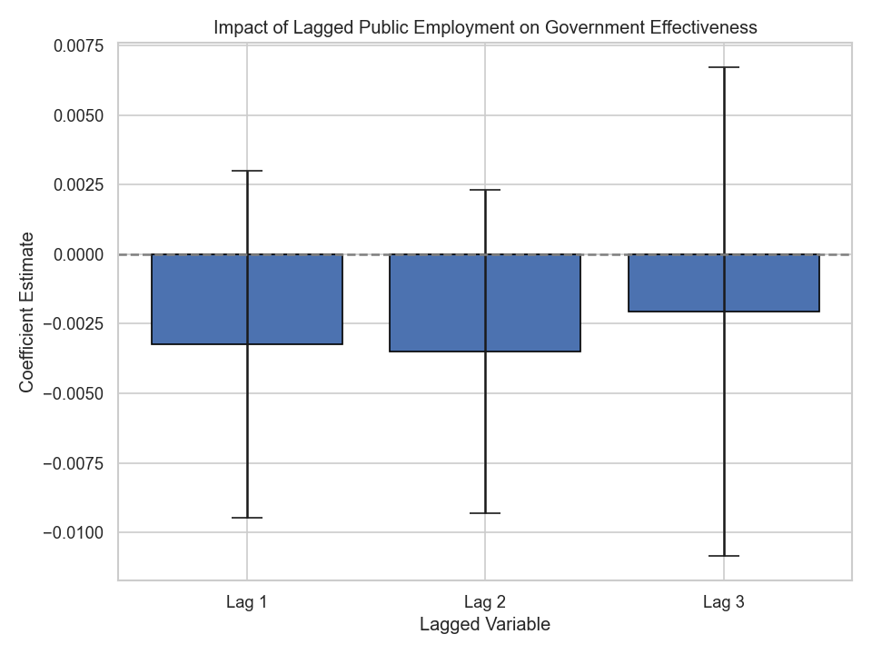

# Public Sector Size and Governance: A Cross-National Panel Study (2000–2019)
_Mapping the relationship between bureaucracy, governance quality, and development across 150+ countries._

## Abstract
This project investigates how the size of the public sector—measured by employment share—interacts with institutional governance quality and economic performance across 150+ countries from 2000 to 2019. Leveraging World Governance Indicators, World Bank development data, IMF macro forecasts, and ILO employment statistics, we visualize regional trajectories, conduct focused case analysis on East Asia & Pacific, and estimate fixed‑effects panel models to quantify lagged public sector impacts on governance outcomes. The analysis reveals that the relationship between public sector size and governance effectiveness is modest, heterogeneous, and shaped by regional and income-level context.

---

## Key Research Questions
- **RQ1**: How does public sector employment share relate to governance effectiveness across global regions?
- **RQ2**: What lag structure best captures the temporal impact of public sector size on subsequent changes in governance quality?
- **RQ3**: Within the East Asia & Pacific region, how is bureaucratic scale associated with governance effectiveness and economic performance?
- **RQ4**: Are the effects of public sector size on governance nonlinear or context-dependent across regions with varying institutional capacity?
---

## Analytical Framework and Objectives

This repository presents a regionally focused analysis of how public sector scale—measured by government employment share—relates to governance quality and economic outcomes across 150+ countries from 2000 to 2019. Grounded in public administration theory and empirical governance research, the project uses descriptive, visual, and statistical tools to explore the temporal and structural dynamics of bureaucratic impact.

- **Regional Trend Analysis** – Visualize longitudinal patterns in governance effectiveness and public employment share by World Bank region using WGI and ILO data.
- **East Asia & Pacific Case Study** – Analyze the relationship between bureaucratic scale and both governance effectiveness and economic prosperity (logged GDP per capita).
- **Bivariate Exploration** – Use scatter plots and regression lines to examine associations between public sector share and governance across selected regions.
- **Panel Regressions** – Estimate two-way fixed-effects models (PanelOLS) with lagged predictors to test the impact of public sector size on governance quality over time.
- **Interpretive Synthesis** – Assess the regional heterogeneity of results to inform debates on state capacity, bureaucratic reform, and institutional development.

---

## Data Sources and Acquisition

⚠️ _Note: Raw data files are not included in this repository. To reproduce the analysis, please download the following datasets manually from the official sources._

| Source | Dataset Details | Description |
|--------|-----------------|-------------|
| [World Bank – World Development Indicators (WDI)](https://databank.worldbank.org/source/world-development-indicators) | Indicators: GDP per capita (NY.GDP.PCAP.CD), GDP per capita, PPP (NY.GDP.PCAP.PP.CD), GDP per person employed (SL.GDP.PCAP.EM.KD), and Inflation (FP.CPI.TOTL.ZG), for the years 2000–2019 | Used for macroeconomic comparisons and controlling for economic development in visual and regression analysis |
| [IMF – World Economic Outlook (WEO), April 2024](https://www.imf.org/en/Publications/WEO/weo-database/2024/April) | Variables: general government net lending/borrowing (% of GDP), real GDP growth, and general government gross debt (% of GDP) | Used for robustness checks and macro context |
| [World Bank – Worldwide Governance Indicators (WGI)](https://info.worldbank.org/governance/wgi/) | Governance scores for six dimensions (e.g., Government Effectiveness, Rule of Law) from 2000–2019 | Used to assess institutional performance over time |
| [ILO – ILOSTAT Public Sector Employment](https://ilostat.ilo.org/data/) | Indicator: **Employment in general government (% of total employment)** (EMP_TEMP_SEX_ECO_INS_NB) | Used to construct the public sector employment share variable |
| [World Bank – Country Metadata](https://databank.worldbank.org/metadataglossary/world-development-indicators/series/NY.GDP.MKTP.CD) | ISO codes and World Bank regional classifications | Used for merging and regional aggregation |

---

## Repository Architecture

```plaintext
├── Figures/
│   ├── east_asia_bureaucracy_vs_gov_eff.png
│   ├── east_asia_bureaucracy_vs_log_gdp.png
│   ├── east_asia_vs_world_gov_eff.png
│   ├── government_effectiveness_over_time.html
│   ├── lagged_public_employment_effects.png
│   ├── region_government_effectiveness_trend.png
│   ├── region_public_sector_share_trend.png
│   └── region-all-wgi-indicators.png
│
├── Output/
│   ├── cleaned_ilo.csv
│   ├── cleaned_wdi.csv
│   ├── cleaned_weo.csv
│   ├── cleaned_wgi.csv
│   └── master_panel_cleaned.csv
│
├── analysis.py
├── clean and build master panel.py
├── README.md
├── requirements.txt
```

## Key Results

This section presents the core findings of the analysis, supported by visualizations that trace how **public sector employment**, **governance quality**, and **economic performance** interact across regions. Taken together, the results suggest that while **bureaucratic scale** varies widely across regions, its relationship with governance is *modest* and *highly context-dependent*.

---

### Regional Patterns in Governance and Bureaucracy

#### 🟦 Public Sector Employment Share by Region (2000–2019)
This line plot shows how the **size of the public sector** varies sharply across regions. *Europe & Central Asia* and *North America* maintain **consistently higher public employment shares** (20–25%), while regions like *South Asia* and *East Asia & Pacific* exhibit **leaner bureaucratic footprints**. These differences form the structural foundation for exploring whether *“more government”* correlates with *stronger institutions*.


#### 🟦 Governance Effectiveness by Region (2000–2019)
**Governance effectiveness** has *improved modestly* in *East Asia & Pacific*, remained *stable* at a high level in *North America*, and **deteriorated or stagnated** in parts of *Sub-Saharan Africa* and *South Asia*. These *diverging institutional trajectories* underscore the importance of **region-specific dynamics** in *state capacity development*.


#### 🟦 All WGI Indicators by Region
This multi-line plot shows the evolution of **all six Worldwide Governance Indicators** by region. *Institutional quality* remains highest in *Europe & North America* across all dimensions, while **low-scoring regions struggle** with *political stability*, *corruption control*, and *regulatory effectiveness*—conditions that may **mediate the impact** of public sector employment.


---

### East Asia & Pacific Case Study

#### 🟩 East Asia vs World – Governance Effectiveness
*East Asia & Pacific* shows a **steady upward trend** in **governance effectiveness**, gradually *converging with the global average*. This case highlights how *institutional improvement* is possible even with *relatively lean public sectors*, challenging the assumption that **size alone determines effectiveness**.


#### 🟩 Bureaucracy vs Governance Effectiveness (East Asia)
This scatterplot illustrates a **weak but positive correlation** between **public employment share** and **governance effectiveness** within *East Asia*. While not conclusive, it suggests that a *moderately larger public workforce* may be associated with *better institutional performance* in *contexts of sustained development*.


#### 🟩 Bureaucracy vs Log GDP per Capita (East Asia)
Compared to governance, **public employment share** shows a **stronger association** with **economic performance** (*logged GDP per capita*). This suggests that **bureaucratic size** may **proxy broader developmental capacity** and *state investment* rather than directly *driving governance quality*.


---

### Panel Regression Findings

#### 🟥 Lagged Public Employment Effects on Governance
The **fixed-effects panel model** estimates the effect of **public sector size** on **governance effectiveness**, using *lagged independent variables* to reduce *simultaneity bias*. Results show **small, statistically insignificant coefficients** across all lag structures. This suggests that in the *short-to-medium run*, **increasing public employment alone** does *not systematically improve governance outcomes* across countries.


---

### Spatial Governance Trends

#### 🗺️ Interactive Choropleth: Government Effectiveness Over Time
This **dynamic HTML choropleth** tracks **governance effectiveness** from *2000 to 2019*. It highlights *rising scores* in parts of *East Asia* and *Latin America*, contrasted with *persistent challenges* in *Sub-Saharan Africa* and *South Asia*. These **spatial patterns** reinforce the **region-specific nature** of *institutional trajectories*.

🔗 [Click here to view the interactive choropleth](Figures/government_effectiveness_over_time.html)

## Discussion

The analysis reveals that the relationship between public sector size and governance quality is highly heterogeneous and context-dependent. While regions like East Asia & Pacific show modest positive associations between bureaucratic scale and governance outcomes, cross-country panel regressions suggest that increasing public employment alone does not guarantee institutional improvement.

These findings challenge the simplistic notion that “more government” leads to better governance. Instead, they underscore the importance of complementary factors—such as administrative capacity, policy coherence, and political accountability—that mediate the effectiveness of public employment.

The weak short-run causal effects also suggest that reforms aimed at expanding state capacity must be matched by investments in institutional quality. Future research could deepen this analysis through:
- Subnational case studies or within-country panel data,
- Nonlinear models to detect potential threshold effects,
- And dynamic specifications capturing longer-term institutional feedback loops.

Taken together, the results invite a more nuanced debate on optimal public sector size—one that balances fiscal constraints, governance goals, and development context.

## Policy Implications

Policymakers seeking to strengthen governance should view public sector size not as an end in itself, but as a lever that depends on context and institutional quality. Rather than expanding bureaucracy indiscriminately, investments should focus on building competent, accountable, and mission-driven public workforces—particularly in regions where governance lags despite low employment shares. Strategic recruitment, civil service reform, and performance-based management may yield greater institutional dividends than changes in scale alone.

## Future Directions

This project offers a foundational view of how public sector size relates to governance effectiveness across regions, but several extensions remain possible. Future work could incorporate subnational data to assess within-country variation, explore non-linear or threshold dynamics using interaction terms, and apply causal inference techniques such as instrumental variables or event studies. In addition, comparative case studies could illuminate how administrative capacity evolves over time in relation to political regimes, fiscal constraints, or external shocks such as pandemics or debt crises.

## Conclusion

This project underscores the complexity of the relationship between public sector scale and governance quality. While some regions exhibit modest positive associations, the broader empirical evidence suggests that bureaucratic expansion alone is not a reliable pathway to stronger institutions. Effective governance appears to depend not just on the size of the state, but on how public resources are structured, managed, and held accountable. These findings call for deeper, context-aware reforms aimed at building capable and responsive state institutions.

## How to Reproduce the Code

Follow these steps to replicate the entire pipeline from raw data to final figures and regression outputs.

---

### Step 1: Clone the Repository

```bash
git clone https://github.com/your-username/government-efficiency-project.git
cd government-efficiency-project
```

---


### Step 2: Install Dependencies

```bash
pip install --upgrade pip
pip install -r requirements.txt
```

**Key libraries:** `pandas`, `numpy`, `matplotlib`, `seaborn`, `plotly`, `openpyxl`, `linearmodels`

---

### Step 3: Prepare Raw Data Files

1. Create a folder named `data/` in the project root.
2. Download and save the following files **with exact filenames**:

| Filename                 | Source                                |
|--------------------------|----------------------------------------|
| `data/WDI Data.csv`      | World Bank WDI CSV                    |
| `data/WEOApr2024.xlsx`   | IMF WEO April 2024 Excel              |
| `data/wgidataset.xlsx`   | World Bank WGI Excel                  |
| `data/ILO Data.csv`      | ILO employment CSV                    |
| `data/CLASS.xlsx`        | Country classification metadata       |

---

### Step 4: Run the Data Cleaning and Consolidation Script

```bash
python clean_and_build_master_panel.py
```

This script will generate six cleaned datasets in total:

- Four cleaned datasets corresponding to each dataset with the classification metadata added  
- One consolidated `master_panel_cleaned.csv` containing merged and harmonized data across all sources

All output files will be saved in the `Output/` directory and used for subsequent analysis.

---

### Step 5: Run the Analysis Script

```bash
python analysis.py
```

This will generate:
- Static figures in the `Figures/` directory  
- Regression tables and outputs in the `Output/` directory

---

### Step 6: Review Outputs

- Open the interactive choropleth map:  
  `Figures/government_effectiveness_over_time.html`

- Browse static charts:  
  `.png` files in `Figures/`

- Inspect cleaned datasets:  
  `.csv` in `Output/`

---

